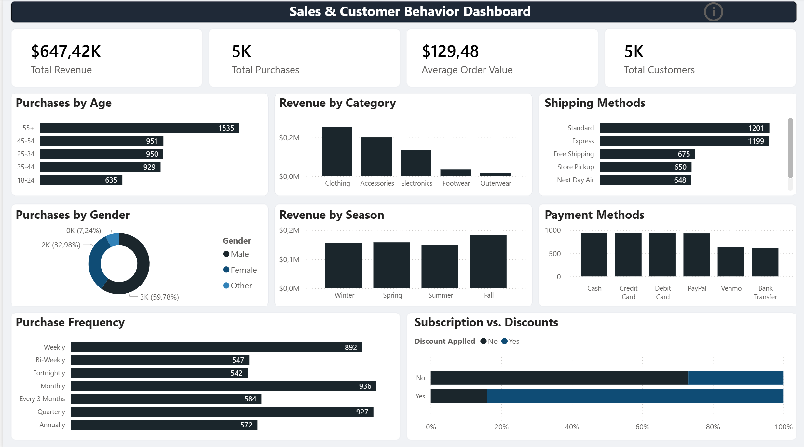
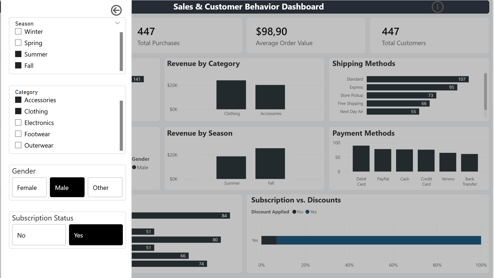
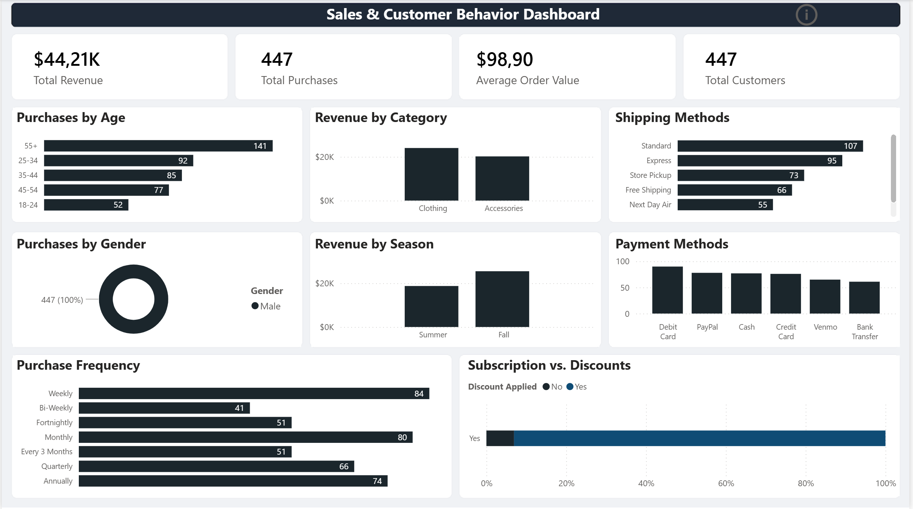

# Sales & Customer Behavior Dashboard (Power BI)

Interactive Power BI dashboard built on a synthetic retail shopping dataset.  
This project demonstrates the full BI workflow: data cleaning, transformation, KPI modeling, DAX measures, dashboard design, and interactive reporting.

The dashboard focuses on answering four key business questions:

1. How much do we sell?  
2. Who buys?  
3. What do customers buy?  
4. How do they buy?  

---

# Dashboard Preview

## Main Dashboard View  

## Filter Panel 

## Example Filtered View  

---

# Project Files

| File | Description |
|------|-------------|
| `Sales.pbix` | Power BI source file |
| `Sales.pdf` | Exported dashboard report |
| `customer_shopping_behavior.csv` | Raw dataset |

# Data Preparation (Power Query)

The raw dataset was transformed into a clean analytical model.

## Key Cleaning Steps

 Corrected data types
Removed duplicate rows  
 Trimmed and cleaned text values  
Standardized missing values 
 Replaced nulls in numeric KPI fields  
 Created business-friendly calculated columns  

## Derived Columns

Purchase Amount Clean , Previous Purchases Clean , Age Group, Loyalty Segment, Spend Bucket, IsSubscribed, IsDiscountApplied, 
Has Review, Season Sort, Frequency Sort

# DAX Measures

Main KPIs created in Power BI:

Total Revenue, Total Purchases, Total Customers, Average Order Value, Average Rating, Subscription Rate, Discount Rate, Review Coverage, Avg Previous Purchases

# Interactive Features

To maximize report space, slicers were moved into a collapsible filter panel using:

  Bookmarks
  Buttons
   Show / Hide navigation

 Available Filters:

  Season
   Category
   Gender
  Subscription Status

# Key Insights
  Clothing generated the highest revenue
    
   Most customers were aged 55+
    
  Standard shipping was most common
    
  Subscription users responded better to discounts
    
   Male customers made the majority of purchases
# Tools Used

- Power BI Desktop  
- Power Query  
- DAX  
- Git / GitHub
